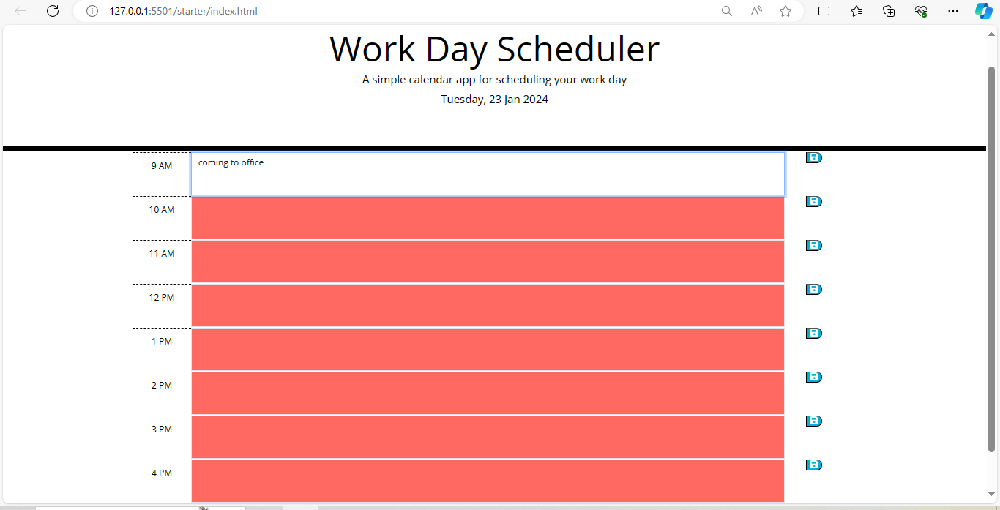

# Day-Calender

A day planner to add events

Functions of the calender:

- The current is displayed day at the top of the calender when open a planner

- Present timeblocks for standard business hours

- Color-coded timeblock based on past, present, and future when the timeblock is viewed.

- Allow a user to enter an event when timeblock is clicked.

- Save the event in local storage when the save button is clicked in that timeblock.

- Persist events between refreshes of a page

The screenshot of calender

URL of deployed application
https://almasmansuri.github.io/Day-Calender/
